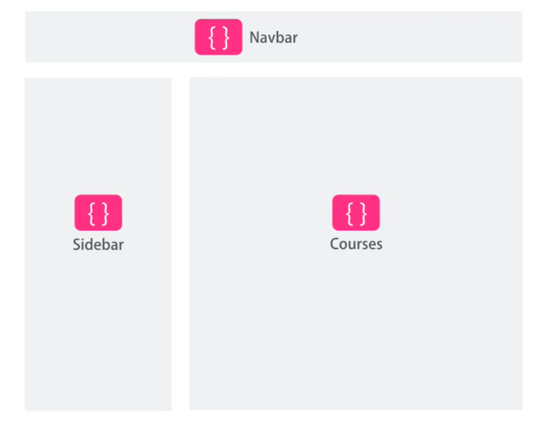
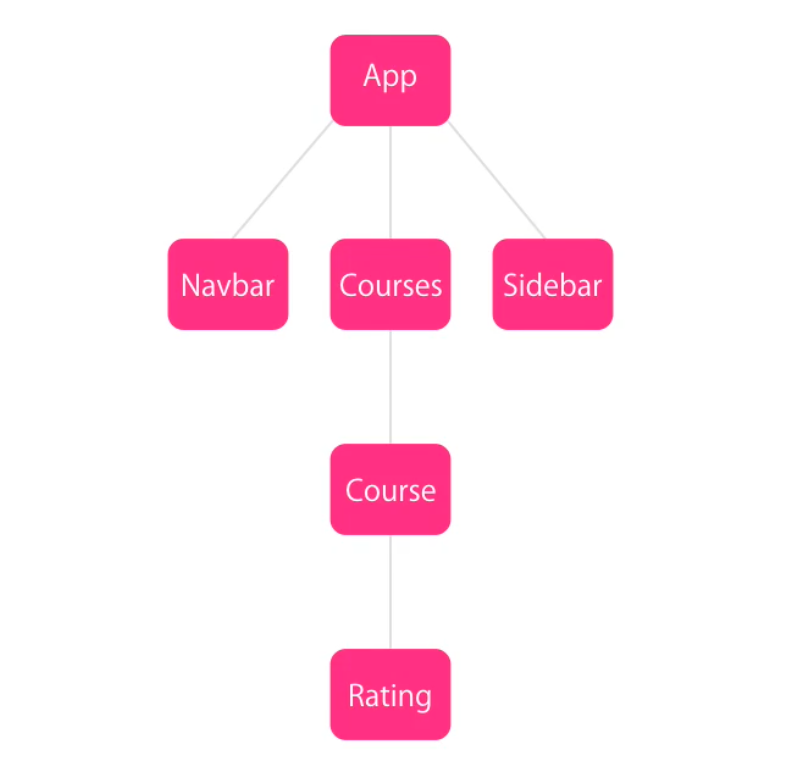

## ng2 architecture

### 4 building blocks on an angular2 app

- components
- directives
- routers
- services

1. Components

- at the core we  have components. 
- they encapsulate the template, data and behaviour of a view.
- every angular 2 app has at least 1 component, that we call the Root Component.
- components are basically typeScript classes that can have properties and methods
- properties to hold the data for the view
- methods implement the behaviour of the view
- each components has the template or html markup for the view, as well as login and data
  behind that view
- components can also contain other components and can be re-use

```
		ex:

		export class RatingComponent {

			averageRating: number;

			setRating(value) {
				...
			}

		}

```



<kbd>multiple components</kbd>




> in javascript/jquery, you get a reference to a dom element in order to modify or handle its events


```
	var heading = document.querySelector('header .title');
		 heading.innerHTML = "hello hello!";
```


#### the same in angular2 is done through binding

- in angular we use binding. In the View, we bind to the methods and properties of our components.
- if there's a change on the value of a property, the dom element bound to this property will 
  refresh automatically.
- So there's no need to get a reference of that element in order to update it.
- Similarly, to handle a dom event like a click, we bind that event to a method on our component.

2. service

- When our components need to communicate with back-end API's we use services
- We use services for any logic not related to view.
- a service is just a plain class that encapsulates any non user interface logic
	+ http calls
	+ logins

3. router
- purely responsible for navigation
- as the user navigates from one page to another, based on url changes, it figures out what
  component to present to the user.

4. directives

- we use directives to work with the dom.
- directives unlike components doesn't have the template or html markup for a view.
- we often use them to add/extend behaviour or modify dom elements

```	ex:

	we can use a directive to automatically grow input box on user focus

	<input type='text' autoGrow />

	//there are angular built-in directives for removing/moving dom elements, adding/removing
	//classes, repeat, styles and also creating your own custom directives


```


